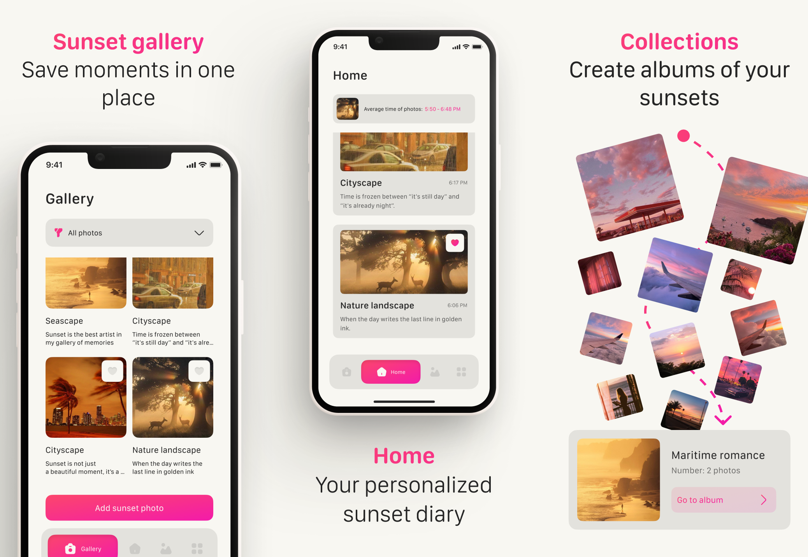
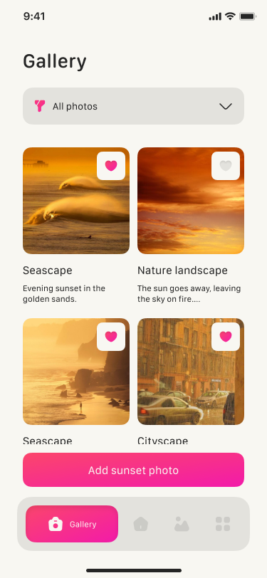
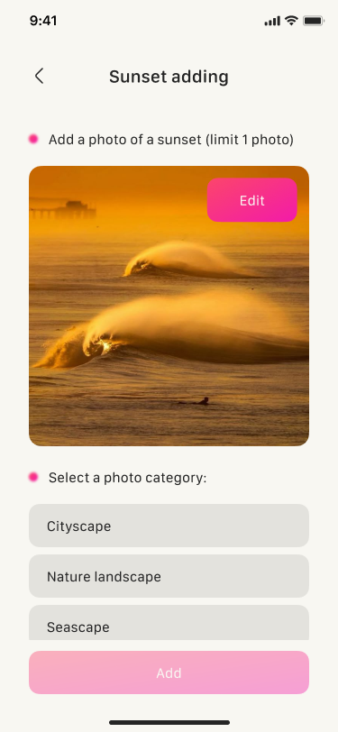
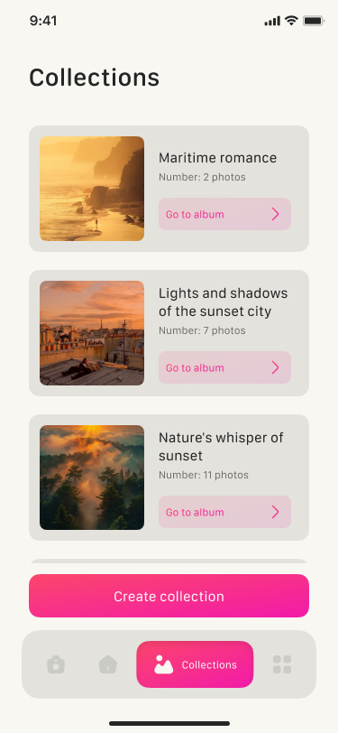

# Sunset Glow: Twilight Ray

**Sunset Glow** is a Flutter app for sunset lovers to collect, categorize, and admire beautiful sunset photos. Capture a moment, choose a category, and add it to your personal gallery.



## 🛠️ Technologies

- **Flutter** and **Dart**
- **Provider** — for state management
- **Hive** — for local photo and album storage
- **Image Picker** — add and edit sunset photos
- **Custom UI** — smooth pink-accented interface
- **Categorization system** — Cityscape, Nature landscape, Seascape, Abstract rays

## 📱 Screenshots

| Gallery | Add Sunset | Collections |
|-------------|---------|------------|
|  |  |  |

## 🚀 How to Run

1. Clone the repo
   ```sh
   git clone https://github.com/NMMustafina/sunset_glow_twilight_ray.git
   ```
2. Install all the packages by typing the following command
   ```sh
   flutter pub get
   ```
3. Run the App
